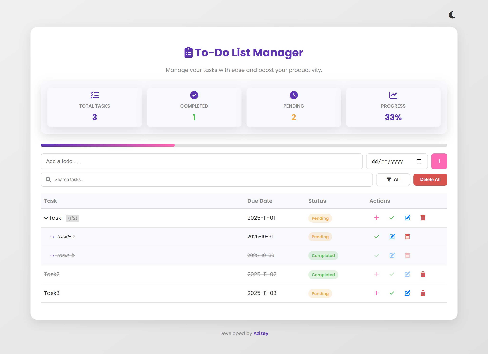
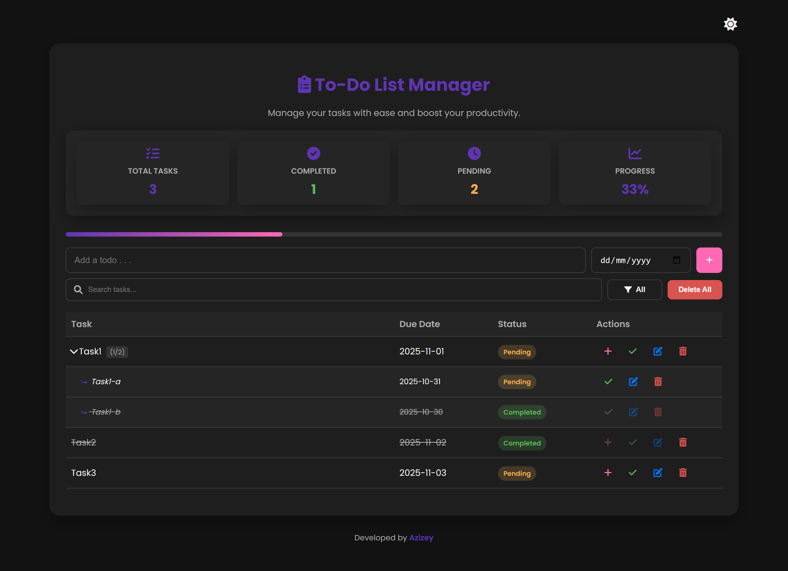

# To-Do List Web Application

This project is a feature-rich To-Do List web application built as part of the RevoU Software Engineering Coding Camp program.

<br>

### Light Theme


### Dark Theme


## 📜 About The Project

This application allows users to efficiently manage their daily tasks. It goes beyond a simple to-do list by incorporating features like sub-tasks, progress tracking, and persistent storage. The project was developed to implement and showcase key concepts in modern front-end web development.

## ✨ Features

- **Task & Sub-task Management**: Add, edit, and delete main tasks and nested sub-tasks.
- **Due Dates**: Assign a due date to every task and sub-task.
- **Mark as Complete**: Toggle completion status for tasks. Parent tasks are automatically updated based on sub-task completion.
- **Persistent Storage**: Tasks are saved to the browser's `localStorage`, so your list is preserved even after closing the tab.
- **Search & Filter**: Instantly search for tasks or filter the list by status (All, Pending, Completed).
- **Statistics Dashboard**: View a summary of total, completed, and pending tasks, along with a visual progress bar.
- **Dark/Light Mode**: Switch between a light and dark theme for comfortable viewing.
- **Confirmation Modals**: Prevents accidental deletion of tasks with a confirmation prompt.
- **Responsive Design**: A clean and adaptive layout that works on various screen sizes.

## 🛠️ Tech Stack

This project was built using standard web technologies:

- **HTML5**: For the structure and content of the web page.
- **CSS3**: For styling, layout, and animations.
- **JavaScript**: For all the application logic and interactivity.

## 🚀 Getting Started

To get a local copy up and running, follow these simple steps.

1.  **Clone the repository**
    ```sh
    git clone https://github.com/azizeeey/CodingCamp-13Oct2025-SitiNurAzizah.git
    ```
2.  **Navigate to the project directory**
    ```sh
    cd CodingCamp-13Oct2025-SitiNurAzizah
    ```
3.  **Open `index.html`**
    Open the `index.html` file directly in your web browser.

## 👤 Contact

**Siti Nur Azizah**
- GitHub: @azizeeey
- LinkedIn: linkedin.com/in/azizeeey

## 🙏 Acknowledgements

- **RevoU** - For the excellent Software Engineering Coding Camp program.